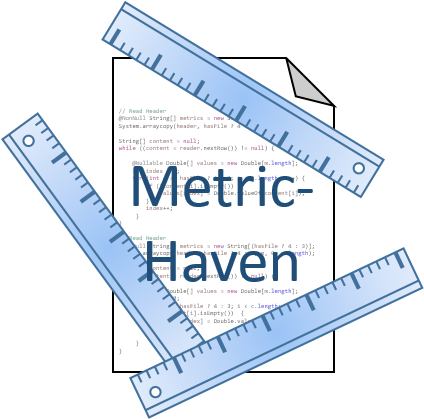

<table style="width:100%">
  <td></td>
  <td><h1>MetricHaven</h1></td>
</table>

An analysis plugin for [KernelHaven](https://github.com/KernelHaven/KernelHaven).

Contains analysis components for running (variability-aware) metrics on Software Product Lines.

## Usage

Place [`MetricHaven.jar`](https://jenkins-2.sse.uni-hildesheim.de/job/KH_MetricHaven/lastSuccessfulBuild/artifact/build/jar/MetricHaven.jar) in the plugins folder of KernelHaven.

### Provided Metrics
For the sake of simplicity we omit the full qualified class names in the following table. All class names start with the
prefix `net.ssehub.kernel_haven.metric_haven.code_metrics`. Most of the metrics support [variability weights](#supported-variability-weights).

<table style="width:100%">
  <tr>
    <th>Class</th>
    <th>Variations</th>
    <th>Description</th>
    <th>Options</th>
  </tr>
  <!-- VariablesPerFunctionMetric -->
  <tr>
    <td><code>VariablesPerFunctionMetric</code></td>
    <td>6,480</td>
    <td>Realizes the <i>Number of internal/external configuration options</i> metric from
        <a href="https://doi.org/10.1145/2934466.2934467"> Do #ifdefs influence the occurrence of vulnerabilities? an
        empirical study of the linux kernel</a> paper.
    </td>
    <td>
      <code>metrics.variables_per_function.measured_variables_type</code>:
      <ul>
        <li><code>INTERNAL</code>: Counts the number of variables used inside the function</li>
        <li><code>EXTERNAL</code>: Counts the number of variables used outside the function</li>
        <li><code>EXTERNAL_WITH_BUILD_VARS</code>: Counts the number of variables used outside the function (considers variables of the build model (requires provided build model))</li>
        <li><code>ALL</code>: <code>EXTERNAL + INTERNAL</code></li>
        <li><code>ALL_WITH_BUILD_VARS</code>: <code>EXTERNAL_WITH_BUILD_VARS + INTERNAL</code></li>
      </ul>
      All variations may be combined with any of the variability weights from below.
    </td>
  </tr>
  <!-- CyclomaticComplexityMetric -->
  <tr>
    <td><code>CyclomaticComplexityMetric</code></td>
    <td>2,593</td>
    <td>Measures the Cyclomatic Complexity of code functions.
    </td>
    <td>
      <code>metrics.cyclomatic_complexity.measured_type</code>:
      <ul>
        <li><code>MCCABE</code>: Measures the cyclomatic complexity of classical code elements as defined by McCabe; uses a simplification that only the following keywords will be counted: <tt>if, for, while, case</tt>.</li>
        <li><code>VARIATION_POINTS</code>: Measures the cyclomatic complexity of variation points only; uses a simplification that only the following keywords will be counted: <tt>if, elif</tt>.</li>
        <li><code>ALL</code>: <code>MCCABE + VARIATION_POINTS</code></li>
      </ul>
      All variations except for <code>MCCABE</code> may be combined with any of the variability weights from below.
  </tr>
  <!-- LoC -->
  <tr>
    <td><code>LoCMetric</code></td>
    <td>6</td>
    <td>Measures the number of lines or statements (single line statement, loop, ..) per function.</td>
    <td>
      <code>metrics.loc.measured_type</code>:
      <ul>
        <li><code>SCOC</code>: Measures the non-CPP statements (also if they are surrounded by an CPP-block).</li>
        <li><code>SCOF</code>: Measures the lines of feature code (only statements surrounded by CPP-blocks, if a variability model is passed, it checks if at least one variable of the variability model is used in the CPP-block)</li>
        <li><code>PSCOF</code>: <code>SCOF / SCOC</code></li>
        <li><code>LOC</code>: Measures the non-CPP lines of code (also of they are surrounded by an CPP-block).</li>
        <li><code>LOF</code>: Measures the lines of feature code (only lines surrounded by CPP-blocks (including if, else, endif), if a variability model is passed, it checks if at least one variable of the variability model is used in the CPP-block)</li>
        <li><code>PLOF</code>: <code>LOF / LOC</code></li>
      </ul>
    </td>
  </tr>
  <!-- NestingDepthMetric -->
  <tr>
    <td><code>NestingDepthMetric</code></td>
    <td>5,186</td>
    <td>Measures the number of nested control structures.</td>
    <td>
      <code>metrics.nesting_depth.measured_type</code>:
      <ul>
        <li><code>CLASSIC_ND_MAX</code>: Maximum depth (within a function) of non-CPP structures.</li>
        <li><code>CLASSIC_ND_AVG</code>: Average depth (within a function) of non-CPP structures.</li>
        <li><code>VP_ND_MAX</code>: Maximum depth (within a function) only of CPP structures.</li>
        <li><code>VP_ND_AVG</code>: Average depth (within a function) only of CPP structures.</li>
        <li><code>COMBINED_ND_MAX</code>: Maximum depth (within a function) of non-CPP and CPP structures.</li>
        <li><code>COMBINED_ND_AVG</code>: Average depth (within a function) of non-CPP and CPP structures.</li>
      </ul>
      All variations except for <code>CLASSIC_ND_*</code> may be combined with any of the variability weights from below.
    </td>
  </tr>
  <!-- EigenVectorCentrality -->
  <tr>
    <td><code>EigenVectorCentrality</code></td>
    <td>12,968</td>
    <td>Eigenvector centrality (= recusrive version of FanInOut-metric).</td>
    <td>
      This metric uses the FanInOut metric and re-uses its
      <code>metrics.fan_in_out.type</code> setting. Please refer to the FanInOut-metric for a description.
    </td>
  </tr>
  <!-- FanInOutMetric -->
  <tr>
    <td><code>FanInOutMetric</code></td>
    <td>12,968</td>
    <td>Measures the number of incoming/outgoing function calls per function</td>
    <td>
      <code>metrics.fan_in_out.type</code>:
      <ul>
        <li><code>CLASSICAL_FAN_IN_GLOBALLY</code>: Measures how often a function is called from anywhere in the code (independently of CPP-blocks).</li>
        <li><code>CLASSICAL_FAN_IN_LOCALLY</code>: Measures how often a function is called from inside the same file (independently of CPP-blocks).</li>
        <li><code>CLASSICAL_FAN_OUT_GLOBALLY</code>: Measures how many other functions (from anywhere in the code) a function is calling (independently of CPP-blocks).</li>
        <li><code>CLASSICAL_FAN_OUT_LOCALLY</code>: Measures how many other functions (in the same file) a function is calling (independently of CPP-blocks).</li>
        <li><code>VP_FAN_IN_GLOBALLY</code>: Measures how often a function is called from anywhere in the code (only if nested in CPP-Blocks).</li>
        <li><code>VP_FAN_IN_LOCALLY</code>: Measures how often a function is called from inside the same file (only if nested in CPP-Blocks).</li>
        <li><code>VP_FAN_OUT_GLOBALLY</code>: Measures how many other functions (from anywhere in the code) a function is calling (only in CPP-blocks).</li>
        <li><code>VP_FAN_OUT_LOCALLY</code>: Measures how many other functions (in the same file) a function is calling (only in CPP-blocks).</li>
        <li><code>DEGREE_CENTRALITY_IN_GLOBALLY</code>: Measures <code>No. of features + 1</code> when function is called from anywhere in the code.</li>
        <li><code>DEGREE_CENTRALITY_IN_LOCALLY</code>: Measures <code>No. of features + 1</code> when function is called from the same file.</li>
        <li><code>DEGREE_CENTRALITY_OUT_GLOBALLY</code>: Measures <code>No. of features + 1</code> for function calls to other functions to anywhere in code.</li>
        <li><code>DEGREE_CENTRALITY_OUT_LOCALLY</code>: Measures <code>No. of features + 1</code> for function calls to other functions in the same file.</li>
        <li><code>DEGREE_CENTRALITY_OUT_NO_STUB_*</code>: Degree centrality variations that do not count calls to empty function stubs (functions with an empty body).</li>
        <li><code>DEGREE_CENTRALITY_OUT_*_NO_EXTERNAL_VPS_*</code>: Degree centrality variations that do not count features that are surrounded around called functions (external &#35;ifdefs).</li>
      </ul>
      <code>DEGREE_CENTRALITY_*</code> variations may be combined with any of the variability weights from below.
    </td>
  </tr>
  <!-- TanglingDegreeFunctionMetric -->
  <tr>
    <td><code>TanglingDegreeFunctionMetric</code></td>
    <td>2,592</td>
    <td>Measures tangling degree values for each CPP block with an expression (no else statements) and sums them up for each function. </td>
    <td>
      <code>metrics.tangling_degree.measured_type</code>:
      <ul>
        <li><code>TD_ALL</code>: Considers all variation points also those with invisible expressions, i.e., else-blocks (default)</li>
        <li><code>TD_VISIBLE</code>: Considers only visible variation points (i.e., no else-blocks) and expressions of previous siblings (i.e., negated conditions of previous conditions for elifs) </li>
      </ul>
     Both variations support any of the variability weights from below.
    </td>
  </tr>
  <!-- BlocksPerFunctionMetric -->
  <tr>
    <td><code>BlocksPerFunctionMetric</code></td>
    <td>2</td>
    <td>Measures the numbers of VP blocks in a function, independent whether they are nested or not.
    </td>
    <td>
      <code>metrics.blocks_per_function.measured_block_type</code>:
      <ul>
        <li><code>BLOCK_AS_ONE</code>: if, elif, else are counted as one block</li>
        <li><code>SEPARATE_PARTIAL_BLOCKS</code>: if, elif, else are treated as three independent blocks</li>
      </ul>
      This metric cannot be combined with the variability weights from below.
    </td>
  </tr>
  <!-- UndisciplinedPreprocessorUsage -->
  <tr>
    <td><code>UndisciplinedPreprocessorUsage</code></td>
    <td>1</td>
    <td>Measures the numbers of C-preprocessor statements, that break statements or control structures into multiple peaces.</td>
    <td>
      This metric has no individual settings and may not be combined with any variability weight from below.
    </td>
  </tr>
  <tr>
    <th>Total</th>
    <td>42,796</td>
    <td></td>
    <td></td>
  </tr>
</table>

## Supported Variability Weights
For the sake of simplicity we omit the full qualified names of the weights in the following table. All names start with the
prefix `metrics.function_measures.`.
<table style="width:100%">
  <tr>
    <th>Weight (Setting)</th>
    <th>Description</th>
    <th>Values</th>
  </tr>
  <!-- Scattering Degree -->
  <tr>
    <td><code>consider_scattering_degree</code></td>
    <td>Weights features used in code blocks based on their scattering degree (how often they are used in code).</td>
    <td>
      <ul>
        <li><code>NO_SCATTERING</code>: Won't consider scattering degree of measured variables</li>
        <li><code>SD_VP</code>: Weights each variable with its variation point scattering (e.g., no of ifdefs a variable is used in).</li>
        <li><code>SD_FILE</code>: Weights each variable with its file scattering.</li>
      </ul>
    </td>
  </tr>
  <!-- Cross-Tree Constraint Ratios -->
  <tr>
    <td><code>consider_ctcr</code></td>
    <td>Weights features based on their usage in cross-tree constraints of the variability model.</td>
    <td>
      <ul>
        <li><code>NO_CTCR</code>: Won't consider constraints of the variability model</li>
        <li><code>INCOMIG_CONNECTIONS</code>: Weights each variable with the no. of distinct variables, specifying a constraint <b>TO</b> the measured variable.</li>
        <li><code>OUTGOING_CONNECTIONS</code>: Weights each variable with the no. of distinct variables, referenced in constraints defined <b>BY</b> the measured variable.</li>
        <li><code>ALL_CTCR</code>: Weights each variable with the (INCOMIG_CONNECTIONS + OUTGOING_CONNECTIONS).</li>
      </ul>
    </td>
  </tr>
  <!-- Feature Distances -->
  <tr>
    <td><code>consider_feature_definition_distance</code></td>
    <td>Weights features based on the distance where they are defined (location of the variability model) and their usage (location of the measured code artifact). Requires an extracted variability model, which provides information where in the file system a feature was defined.</td>
    <td>
      <ul>
        <li><code>NO_DISTANCE</code>: Won't consider feature distances</li>
        <li><code>SHORTEST_DISTANCE</code>: Computes the shortest way to traverse from the folder of the currently measured code artifact to the folder containing the definition of the feature in the variability model. If mutliple definition exist (e.g., supported by Kconfig), the shortes path is used.</li>
    </ul>
    </td>
  </tr>
  <!-- Feature Types -->
  <tr>
    <td><code>consider_feature_types</code></td>
    <td>Weights features based on their data type. Requires an extracted variability model.</td>
    <td>
      <ul>
        <li><code>NO_TYPE_MEASURING</code>: Won't consider any weights with respect to the type of the feature.</li>
        <li><code>TYPE_WEIGHTS_BY_FILE</code>: Requires the configuration of weights per feature type in the configuration file (via <code>metrics.function_measures.weight_definitions</code>). Each type weight is defined via a 2-tuple separated by a colon in the form of <code>name:value</code>.</li>
      </ul>
    </td>
  </tr>
  <!-- Hierarchy Types -->
  <tr>
    <td><code>consider_feature_hierarchies</code></td>
    <td>Weights features based on their hierarchy level as models in the variability model. Requires an extracted variability model, which provides information of the hierarchy.</td>
    <td>
      <ul>
        <li><code>NO_HIERARCHY_MEASURING</code>: Won't consider any feature hierarchies.</li>
        <li><code>HIERARCHY_WEIGHTS_BY_FILE</code>: Requires the configuration of hierarchy weights in the configuration file (via <code>metrics.function_measures.hierarchy_weight_definitions</code>). Each hierarchy type is defined via a 2-tuple separated by a colon in the form of <code>name:value</code>. Supported hierarchy types are <code>top</code>, <code>intermediate</code>, and <code>leaf</code></li>
        <li><code>HIERARCHY_WEIGHTS_BY_LEVEL</code>: The hierarchy (level) is directly used as weight.</li>
      </ul>
    </td>
  </tr>
  <!-- Structures / CoC -->
  <tr>
    <td><code>consider_varmodel_structures</code></td>
    <td>Weights features based on the number of childred / parents they have.</td>
    <td>
      <ul>
        <li><code>NO_STRUCTURAL_MEASUREMENT</code>: Won't consider any feature structures.</li>
        <li><code>NUMBER_OF_CHILDREN</code>: Counts the number of (direct) children a features has.</li>
        <li><code>COC</code>: Count all edges (inspired by CoC).</li>
      </ul>
    </td>
  </tr>
  <!-- Feature Sizes -->
  <tr>
    <td><code>feature_sizes</code></td>
    <td>Computes the Lines of Code controlled by a feature, i.e., the feature size.</td>
    <td>
      <ul>
        <li><code>NO_FEATURE_SIZES</code>: Disables this weight.</li>
        <li><code>POSITIVE_SIZES</code>: Counts the Lines of Code (statements) controlled by the positive form of a feature, i.e., which are included if the feature is selected.</li>
        <li><code>TOTAL_SIZES</code>: Counts all statements, which are controlled by the feature in any form, i.e., Lines that are included either if the feature is selected or deslected.</li>
      </ul>
    </td>
  </tr>
</table>

## Dependencies

In addition to KernelHaven, this plugin has the following dependencies:
* A code extractor, which extracts an AST (`SyntaxElement`s).
* A variability model extractor, which provides support for
  * Cross-tree constraint ratios for <code>CTCR</code> options.
  * Location of feature definitions for <code>feature_definition_distance</code> options.
* A build model extractor, for some of the options (see description from above).

## Guidance
The follwoing classes execute all currently available metrics in one step, without requiring a detailed configuration:
<table style="width:100%">
  <tr>
    <th>Class</th>
    <th>Description</th>
  </tr>
  <tr>
    <td><code>net.ssehub.kernel_haven.metric_haven.metric_components.AllFunctionMetrics</code></td>
    <td>All code function metrics</td>
  </tr>
  <tr>
    <td><code>net.ssehub.kernel_haven.metric_haven.metric_components.MetricsRunner</code></td>
    <td>All variations of one code function metric, requires <code>analysis.metrics_runner.metrics_class</code> as additional parameter so specify the metric to be executed.</td>
  </tr>
</table>

## Video Tutorials

#### Introduction and Experiments

## License

This plugin is licensed under the [Apache License 2.0](https://www.apache.org/licenses/LICENSE-2.0.html).
